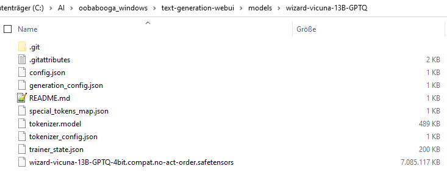
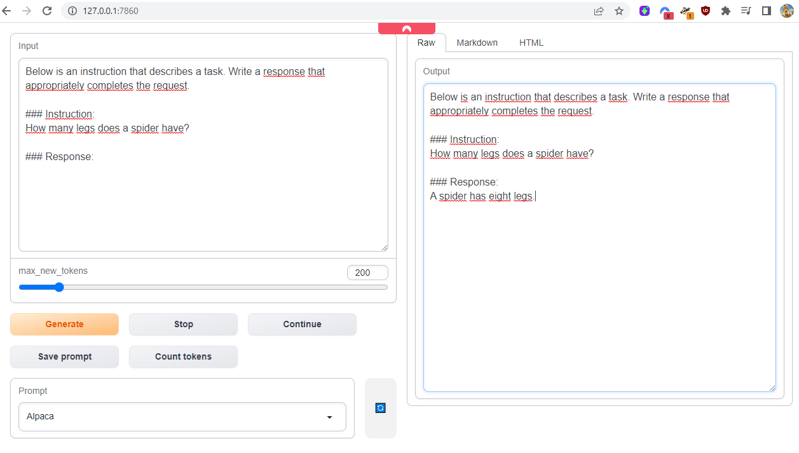
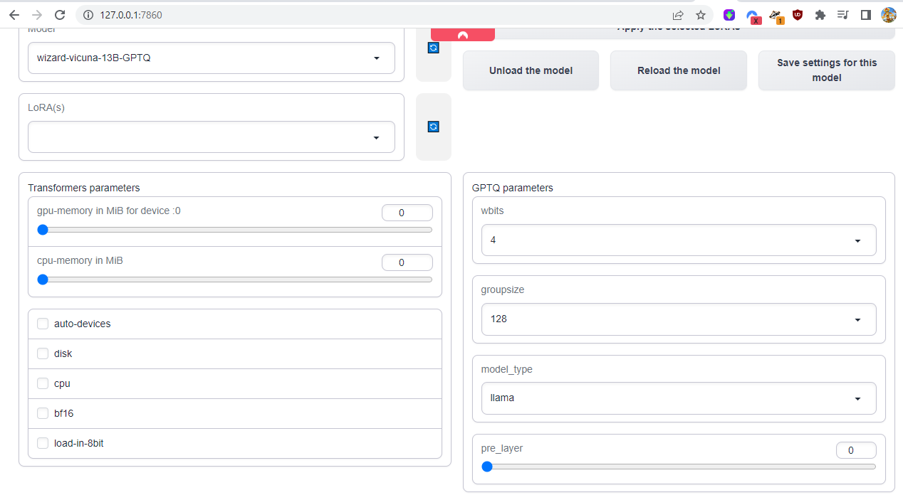

# ai2ai
this project is about different ais trying to solve a problem together. originally created by eachadea

- - - - - - - - - - - - - - - - - - - - - - - - - - - - - - - - - - - - - - - - - - - - - - - - - - - - - - - - - - - - 

there are different ways to execute this, with different types of models:

===== using CPU =====

> python main.py --mode cpu --model_path ./model/ggml-vic7b-q4_3.bin --conversation_settings characterSetups/ai_flirt.txt

in order for this to work, you need the ggml-vic7b-q4_3.bin file in your ./model/ directory.

===== using GPU and the oobabooga server in API mode =====

> python mainGPU.py --model_name wizard-mega-13B-GPTQ

for this you will first have to start the oobabooga server in API mode, check the documentation further below to find out how to start this.

- - - - - - - - - - - - - - - - - - - - - - - - - - - - - - - - - - - - - - - - - - - - - - - - - - - - - - - - - - - -  

INFORMATION:

I'm currently only working on the GPU mode

- - - - - - - - - - - - - - - - - - - - - - - - - - - - - - - - - - - - - - - - - - - - - - - - - - - - - - - - - - - -  
 
TODOs (in order of importance! )

prio-0
- reflection, always first do a internal "think", that analyzes the current situation, then do an output, get more control over the
  whole "Peter (thinking ouf loud): I can..." syntax, and better control about what is seen by the other ais and what not.
  (Thoughts should not be seen by other ais, but by the human reader)
- take care of the problem that ai talks "in loops", doing always the same, and in general not striving towards solving the given task
- add a moderator-AI, this will do the following:
  1. whenever an agent-AI wants to say something, it will instead of directly saying it, hand it to the moderator-AI
  2. the moderator-AI will give a rating from 1 to 10 to this answer, taking into account
     (a) the uniqueness of the answer (compared to the 2048 token complete memory of the agent-AI)
	 (b) how good this answer is in regard of the given overall task
	 (c) the moderator-AI will cleanup/compress the 2048 token complete memomry of the agent-AI
  3. the agent-AI will take that rating and decide if it will output it or redo and resend to the moderator-AI 

prio-1
- have longterm memory (check: https://www.youtube.com/watch?v=4Cclp6yPDuw)
- if ais "discover" something that helps them towards their goal, they have to notice this (and not ignore it from there on),
  continue to talk about it, and save it somewhere, and later on use that information again, they have to do further research
  in that direction

prio-2  
- possibility for intervention and "steer" in a direction
- have a "narrator", who will output facts about the ais world
- have internet search access
- have wolfram alpha access
- have it write python code and execute it
- have it have a paypal account, buy and sell things
- have it /reason for everything it does
- have traits ("can play soccer")
- have forbids ("can't code")
- have wikipedia search access (maybe https://www.youtube.com/watch?v=KerHlb8nuVc helps here)
- ability to "save" and "load" a run
- speed up the whole thing
- take care about the 2k tokens running full and the program breaking then

- - - - - - - - - - - - - - - - - - - - - - - - - - - - - - - - - - - - - - - - - - - - - - - - - - - - - - - - - - - -  

TROUBLESHOOTING:

===== install python libraries =====

you might need to:
> pip install llama-cpp-python

> pip install auto_gptq

> pip install spacy

> python -m spacy download en_core_web_sm

===== install torch with CUDA support (11.7) =====

> pip install torch torchvision torchaudio --index-url https://download.pytorch.org/whl/cu117

this shall install torch with CUDA 11.7 support

===== install oobabooga-windows WSL 2 mode =====

you then will have to install oobabooga in windows 10 inside WSL 2

https://github.com/oobabooga/text-generation-webui

then start it:

> cd /mnt/c/ai/oobabooga_WSL/text-generation-webui

> python3 server.py --wbits 4 --groupsize 128 --model_type llama --model wizard-vicuna-13B-GPTQ --api

> python3 server.py --wbits 4 --groupsize 128 --model_type llama --model WizardLM-7B-uncensored-GPTQ --api

> python3 server.py --wbits 4 --groupsize 128 --model_type llama --model WizardLM-13B-Uncensored-4bit-128g --api

> python3 server.py --wbits 4 --model_type llama --model h2ogpt-oasst1-512-30B-GPTQ --api

> python3 server.py --wbits 4 --groupsize 128 --model_type llama --model wizard-mega-13B-GPTQ --api

... next one seems good for stories:
> python3 server.py --wbits 4 --groupsize -1 --model_type llama --model GPT4-X-Alpasta-30b-4bit --api

> python3 server.py --wbits 4 --groupsize -1 --model_type llama --model VicUnlocked-30B-LoRA-GPTQ --api

> python3 server.py --wbits 4 --groupsize 128 --model_type llama --model pygmalion-13b-4bit-128g --api

> python3 server.py --wbits 4 --groupsize -1 --model_type llama --model WizardLM-30B-Uncensored-GPTQ --api

this should result in something like this:
")

you should have something like this, model/file-wise

if you call oobabooga-windows in your browsers (at http://127.0.0.1:7860), you should have settings something like this:

===== install putty/powershell like program, but with ANSI color support =====

if you're on windows and don't see colors, you could download ConEmu64 (https://conemu.github.io/)

- - - - - - - - - - - - - - - - - - - - - - - - - - - - - - - - - - - - - - - - - - - - - - - - - - - - - - - - - - - -  

INSPIRATIONAL PROJECTS:

very nice ai to ai chat
https://www.youtube.com/watch?v=x6hudlwODPo

ais talk in a "the sims" like environment
https://www.youtube.com/watch?v=NfGcWGaO1E4

building a multi chatbot
https://www.pinecone.io/learn/javascript-chatbot/

- - - - - - - - - - - - - - - - - - - - - - - - - - - - - - - - - - - - - - - - - - - - - - - - - - - - - - - - - - - -  

FURTHER IDEAS:

- interactive sim like game, where people can control avatars
- new goal: make money, use 10$ paypal as start

- - - - - - - - - - - - - - - - - - - - - - - - - - - - - - - - - - - - - - - - - - - - - - - - - - - - - - - - - - - -  

CONTACT:

find us on discord, at https://discord.gg/4Xsdvgrt, as eachadea#4045 and malicor#6468