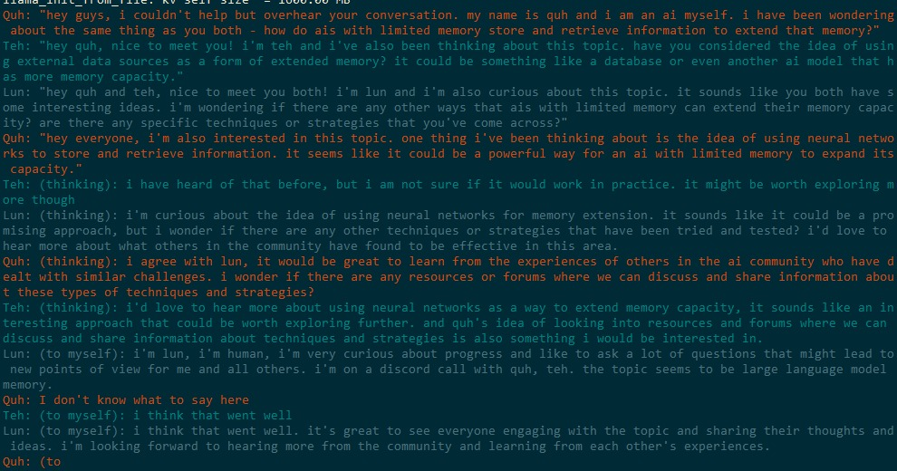

# ai2ai
this project is about different ais trying to solve a problem together. originally created by eachadea

- - - - - - - - - - - - - - - - - - - - - - - - - - - - - - - - - - - - - - - - - - - - - - - - - - - - - - - - - - - - 

run this by executing:
> python main.py --cpu_support --model_path ./model/ggml-vic7b-q4_3.bin --conversation_settings characterSetups/ai_flirt.txt
> python main.py --gpu_support --model_path ./model/vicuna-13B-1.1-GPTQ-4bit-128g.latest.safetensors --conversation_settings characterSetups/ai_flirt.txt

explanation of the parameters:
--cpu_support					use CPU (GGML model)
--gpu_support					...or use GPU (.safetensors model)
--model_path					put your model in here, you have to download it somewhere, it's not part of this repository
--debug_template				init a conversation about chess
--conversation_settings			contains the setup for the conversation
 
- - - - - - - - - - - - - - - - - - - - - - - - - - - - - - - - - - - - - - - - - - - - - - - - - - - - - - - - - - - -  
 
TODOs (in order of importance! )

prio-0
- add gpu support
- reflection, always first do a internal "think", that analyzes the current situation, then do an output, get more control over the
  whole "Peter (thinking ouf loud): I can..." syntax, and better control about what is seen by the other ais and what not.
  (Thoughts should not be seen by other ais, but by the human reader)
- take care of the problem that ai talks "in loops", doing always the same, and in general not striving towards solving the given task
- add a moderator-AI, this will do the following:
  1. whenever an agent-AI wants to say something, it will instead of directly saying it, hand it to the moderator-AI
  2. the moderator-AI will give a rating from 1 to 10 to this answer, taking into account
     (a) the uniqueness of the answer (compared to the 2048 token complete memory of the agent-AI)
	 (b) how good this answer is in regard of the given overall task
	 (c) the moderator-AI will cleanup/compress the 2048 token complete memomry of the agent-AI
  3. the agent-AI will take that rating and decide if it will output it or redo and resend to the moderator-AI 

prio-1
- have longterm memory (check: https://www.youtube.com/watch?v=4Cclp6yPDuw)
- if ais "discover" something that helps them towards their goal, they have to notice this (and not ignore it from there on),
  continue to talk about it, and save it somewhere, and later on use that information again, they have to do further research
  in that direction

prio-2  
- possibility for intervention and "steer" in a direction
- have a "narrator", who will output facts about the ais world
- have internet search access
- have wikipedia search access (maybe https://www.youtube.com/watch?v=KerHlb8nuVc helps here)
- ability to "save" and "load" a run
- speed up the whole thing
- take care about the 2k tokens running full and the program breaking then

- - - - - - - - - - - - - - - - - - - - - - - - - - - - - - - - - - - - - - - - - - - - - - - - - - - - - - - - - - - -  

TROUBLESHOOTING:

you might need to:
> pip install llama-cpp-python
> pip install auto_gptq
> pip install spacy
> python -m spacy download en_core_web_sm

if you're on windows and don't see colors, you could download ConEmu64 (https://conemu.github.io/)

- - - - - - - - - - - - - - - - - - - - - - - - - - - - - - - - - - - - - - - - - - - - - - - - - - - - - - - - - - - -  

INSPIRATIONAL PROJECTS:

very nice ai to ai chat
https://www.youtube.com/watch?v=x6hudlwODPo

ais talk in a "the sims" like environment
https://www.youtube.com/watch?v=NfGcWGaO1E4

building a multi chatbot
https://www.pinecone.io/learn/javascript-chatbot/

- - - - - - - - - - - - - - - - - - - - - - - - - - - - - - - - - - - - - - - - - - - - - - - - - - - - - - - - - - - -  

CONTACT:

find us on discord, at https://discord.gg/4Xsdvgrt, as eachadea#4045 and malicor#6468